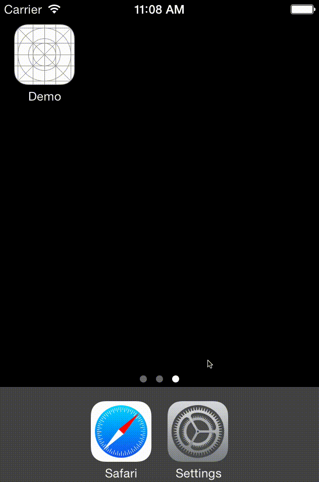

DKUserMessageView
=================

Simple iOS User Message View with Optional Loading.



# Installation
Add the files in the DKUserMessageView folder to your project.

# Usage

```  objc
DKUserMessageView *simpleMessageView = [[DKUserMessageView alloc] initWithFrame:CGRectMake(0, 40, self.view.bounds.size.width, 100)];
[self.view addSubview:simpleMessageView];
[simpleMessageView dk_displayMessage:@"Simple Message"];        
```

In particular, DKUserMessageView can be used in a loading routine
``` objc
UIImageView *imageView = [[UIImageView alloc] initWithFrame:CGRectMake(0, 0, 100, 80)];
[self.view addSubview:imageView];
        
DKUserMessageView *messageView = [[DKUserMessageView alloc] init];
messageView.frame = imageView.frame;
[self.view addSubview:messageView];
        
// set `spinner` to YES to show a loading spinner (`UIActivityIndicatorView`)
[messageView dk_loading:YES spinner:YES];
dispatch_async(dispatch_get_global_queue(DISPATCH_QUEUE_PRIORITY_DEFAULT, 0), ^{
  NSURL *url = [NSURL URLWithString:@"http://placekitten.com/100/80"];
  UIImage *image = [UIImage imageWithData:[NSData dataWithContentsOfURL:url options:NSDataReadingMappedIfSafe error:nil]];
  dispatch_async(dispatch_get_main_queue(), ^{
    if (image.size.width>0) {
      [messageView dk_loading:NO];
      imageView.image = image;
    }
    else {
      [messageView dk_displayMessage:@"Error loading :-("];
    }
  });
});

```

## Customization
- `dk_userMessageLabel` Access the user message label to customize.
- `dk_userMessageLabelTop` The top position (y-coordinate) of the user message label. 
- `dk_spinner` Access the loading spinner to customize. The default style is `UIActivityIndicatorViewStyleGray`.

# Demo
DKUserMessageView includes a sample project in the Demo folder.


# Compatibility
- This project uses ARC.
- This project was tested with iOS 7.

# TODO
- Unit tests

# Say Hi
- [github.com/dkhamsing](https://github.com/dkhamsing)
- [twitter.com/dkhamsing](https://twitter.com/dkhamsing)
- [contact](http://alldonegoodbye.tumblr.com/ask)

# License
DKUserMessageView is available under the MIT license. See the [LICENSE](LICENSE) file for more info.
